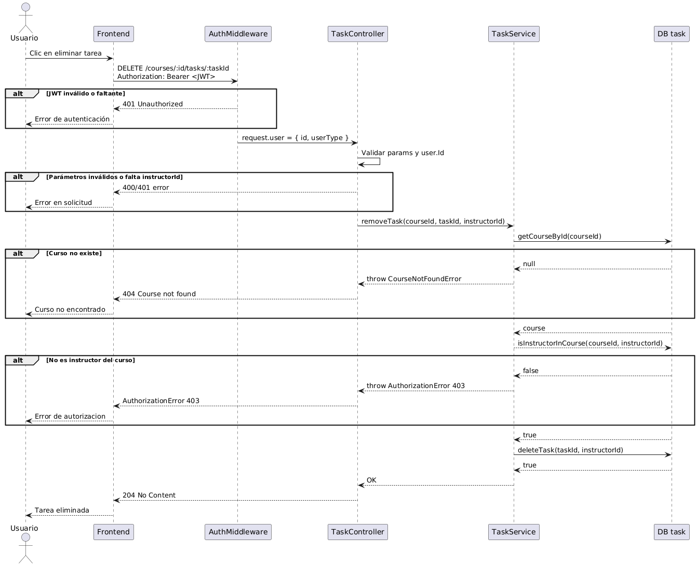

# Courses-service

## Run

`docker compose up` install dependencies, run the API and the database

## See database content

mysql -u root -p

USE courses_db;

SHOW TABLES;

SELECT * FROM Course;

## Explanation

When using `docker compose up --build` it builds the image of the container of the app, and the volume for the database. If we use `docker compose down` the containers will be stopped but the database will remain in memory, on the other hand, if we use `docker compose down -v` the containers and the volumes will be deleted (including the db volume).

## Using prisma studio with docker

Run in terminal:
`docker exec -it cursos-app sh`

`npx prisma studio --hostname 0.0.0.0 --port 5555`

Open in a browser:
`localhost:5555`

## Correr con docker

Para correr el servicio con los últimos cambios:
`docker compose up --build`

Para borrar el volúmen con la bdd (OJO! borra la bdd) (es decir, borrar la bdd ya sea por nuevos cambios, etc):
`docker compose down -v`

Para parar los containers sin borrar la bdd:
`docker compose down`

### Usar semilla en la bdd (si borré la bdd y quiero tener datos nuevos)

`docker exec -it cursos-app npm run seed`

## Seguridad en las solicitudes

Para la seguridad en las solicitudes trabajamos con un token JWT, este token se codifica como un string que se encuentra compuesto por 3 partes, separadas cada una por un punto:

`<HEADER>.<PAYLOAD>.<SIGNATURE>`

Ejemplo:

`eyJhbGciOiJIUzI1NiIsInR5cCI6IkpXVCJ9.  eyJpZCI6IjEyMyIsInVzZXJUeXBlIjoiSU5TVFJVQ1RPUiJ9.        SflKxwRJSMeKKF2QT4fwpMeJf36POk6yJV_adQssw5c`             
- Header: especifica el algoritmo de firma, como HS256.

- Payload: datos del usuario (por ejemplo, id, userType, etc.).

- Signature: una firma digital generada así:

`HMACSHA256(
  base64UrlEncode(header) + "." + base64UrlEncode(payload),
  secret_key
)`

Esto es seguro porque no se puede modificar el contenido (payload) sin invalidar la firma digital. Cuando el servidor recibe el token, vuelve a generar la firma con el header + payload y la clave secreta. Si la firma no coincide con la del token recibido → el token es inválido o ha sido alterado.

Si un usuario quisiera modificar el payload para cambiar de rol por ejemplo, NO podría generar una firma válida, porque no tiene la clave secreta del servidor.

En los siguientes diagramas de secuencia se muestran los casos en los que se desean borrar una tarea y obtener las entregas de una tarea con sus respectivas variantes:

<h3>Diagrama de secuencia - Eliminar una tarea</h3>

Se puede ver en el diagrama que cuando el usuario desea borrar una tarea, envía la solicitud correspondiente con el token JWT que contiene encriptada la información del usuario (Id, Tipo de usuario = Alumno o profesor).

Una vez que llega al servidor se verifica que el token sea válido, esto es que tanto el header como el payload como la firma sean consistentes. En caso de no serlo, se devuelve el error 401 Unauthorized.

Luego se procede a la verificación de que la información del usuario dentro del token esté completa, en caso contrario se envía un error 401.

Una vez verificada esta información se procede a eliminar la tarea, para ello se verifica que el curso pasado en la request exista, sino se devuelve un error 404 Not Found. Después se verifica que el instructor sea realmente instructor de ese curso y si no lo fuera se devuelve un error AuthorizationError 403.

Finalmente se procede a eliminar la tarea y se devuelve el código 204 No Content, que demuestra que la tarea fue eliminada con éxito.

<h3>Diagrama de secuencia - Obtener todas las entregas de una tarea de un curso (sólo para profesores)</h3>

En el siguiente diagrama se muestra la secuencia del endpoint que permite a un profesor obtener todas las entregas de una tarea específica.

Al igual que en el diagrama anterior se puede ver que primero se verifica que la información del token sea válida.

Se puede ver que en el caso en el que el rol del usuario (obtenido del token JWT) no es el de profesor, se devuelve el error 403 Forbidden. Lo mismo sucede si el id del instructor dentro del token no coincide con el id de la request.

Una vez que se verifica que el usuario es instructor y su id es el mismo del de la rquest, se procede a pedir las entregas de una tarea. Para ello se verifica que el instructor sea realmente un instructor del curso pasado en la request y en caso de serlo, se devuelve la información con código 200 Ok.

<h3>Pruebas con Postman - Obtención de tareas exitosa</h3>

Se obtienen las entregas de la tarea "t1"  porque el usuario con id igual a '5' es profesor del curso.

En este caso se obtiene el mensaje de error que corresponde a que el id del token '7' no coincide con el id pasado en la request que es '5', por lo que se obtiene un error 403 Forbidden.

Este último caso representa que el usuario es un docente pero no es docente del curso donde se publicó la tarea "t1", por lo que pasa las verificaciones del token, pero no se encuentra como profesor del curso en la base de datos, generando así un error 403 Forbidden.